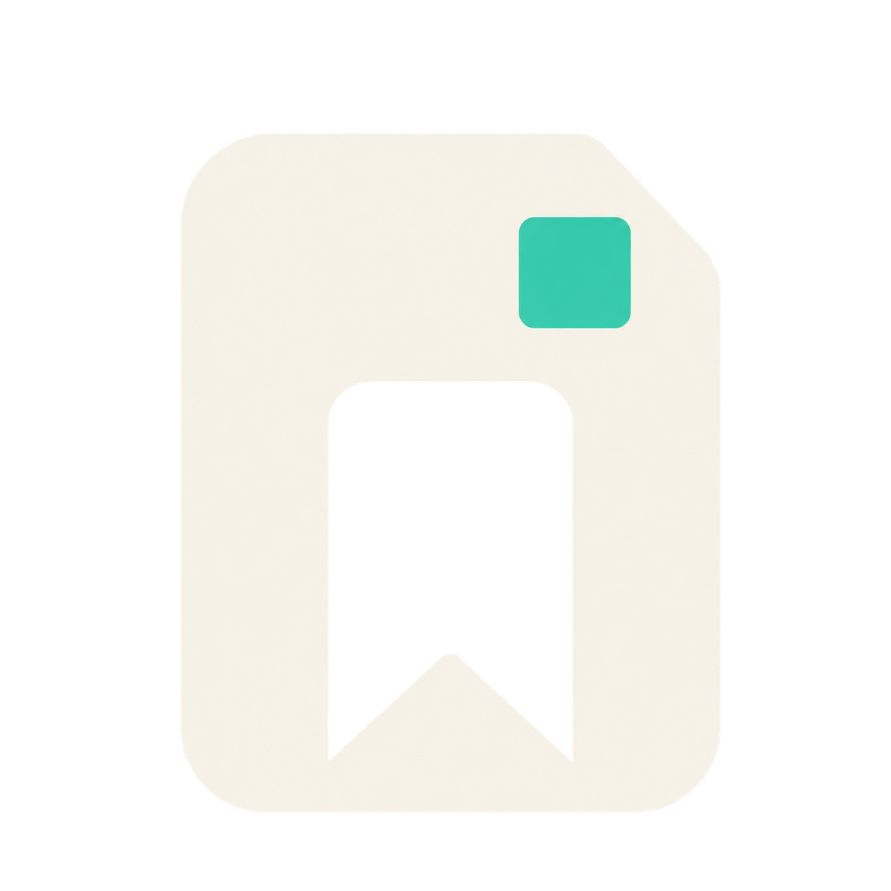

# artmark brand kit

This page records the brand choices and the supplied image assets. The product name is lowercase **artmark** in prose, headings, and graphics. The CLI, package, and paths are also `artmark`.

| Asset | Use |
| --- | --- |
| [logo.png](../assets/logo.png) | Canonical transparent mark; keep the ivory document/bookmark and mint square together. |
| [hero-image.png](../assets/hero-image.png) | README illustration of first session, local catalog, and later retrieval. |
| [social-image.png](../assets/social-image.png) | 16:9 graphic for launch posts. |
| [social-preview.png](../assets/social-preview.png) | 2:1 GitHub repository preview; upload through repository Settings when public. |



## Brand rules

### Brand idea

**artmark = bookmarks for agents.**

The core conceptual pair is:

**temporary sessions ↔ durable artifacts**

The product should feel local, dependable, quiet, technical, and lightweight—not “AI magical.”

### Core messaging

Use these consistently:

**Primary descriptor:**
**Local bookmark manager for AI agents**

**Primary launch line:**
**Your sessions are temporary. Your artifacts don’t have to be.**

**Technical description:**
**A local artifact registry that helps agents rediscover durable artifacts across sessions.**

**Mental model:**
**Yellow Pages for your artifacts.**

I would avoid calling artmark an “AI memory system.” That puts it in a much broader and noisier category than what you actually built.

### Color palette

These are good starting values based on the direction you've already established:

| Role | Color | Hex |
|---|---|---|
| Midnight | Deep navy | `#071B2F` |
| Ivory | Warm off-white | `#F4EFE4` |
| Mint | Primary accent | `#36D6B1` |
| Muted Slate | Secondary text | `#8193A3` |
| Panel Navy | Elevated surfaces | `#0C2942` |
| Border Blue | Subtle borders | `#294A62` |

Use mint sparingly. It should mean **active / connected / found**, rather than becoming the entire brand color.

### Logo

Your primary logo should be exactly what you now have:

**ivory document/bookmark mark + mint square, transparent background.**

Do not make the navy square/background part of the logo.

The supplied file is the full-color mark. If monochrome versions are needed later, use ivory for dark backgrounds and navy for light backgrounds; the mint square may disappear in those versions.

Avoid shadows, glows, outlines, or containers in the canonical logo file. Those effects belong to illustrations, not the mark itself.

For small sizes, make sure the bookmark notch remains visible at roughly 24px. If it collapses visually, create a simplified favicon variant rather than distorting the main logo.

### Typography

I would keep this very simple.

**Marketing/UI:** Manrope
**Code/CLI:** JetBrains Mono

The `artmark` wordmark can remain custom/stylized rather than being recreated in Manrope.

Use heavier weights for headlines and normal/medium weights everywhere else. Avoid overly futuristic typefaces—the product's strength is that it feels practical.

### Visual language

Use dark navy canvases, ivory cards, thin mint connector lines, simple artifact icons, compact metadata chips, rounded corners, and plenty of empty space.

The recurring visual metaphor should be:

**artifact → compact index card → rediscovery → live source**

Not:

**artifact → database → stored file**

That distinction should show up everywhere—from the README illustrations to launch graphics.

### Voice

Write like a developer tool, not an AI startup.

Prefer:

> Find the artifact again.

> Stored locally in SQLite.

> artmark keeps the pointer, not the file.

> Search before asking the user to resend it.

Avoid:

> Supercharge your AI workflow.

> Unlock infinite memory.

> Intelligent second brain for autonomous agents.

The understated framing actually makes the idea stronger.

### Naming conventions

Use:

**artmark** in prose and headings.

Use:

`artmark` for CLI, package names, filesystem paths, and code.

For example:

```text
artmark
artmark search "SAML migration"
~/.artmark/artmark.db
```

---

## Social graphic brief

### Source prompt

> Create a polished 16:9 launch graphic for **artmark**, a local bookmark manager for AI agents.
>
> Use the supplied artmark logo as the exact visual reference. Preserve the logo geometry: warm ivory document shape, bookmark cutout, folded top-right corner, and small mint/teal square. Do not redesign the logo.
>
> The image should communicate one simple idea:
>
> **AI sessions are temporary. artmark makes the artifacts encountered in those sessions durable and discoverable later.**
>
> Use a clean left-to-right story with exactly three stages:
>
> **LEFT — FIRST SESSION**
> Show a minimal AI-agent/session panel. Four durable artifacts flow out of the session toward artmark:
> - Google Doc
> - Figma design
> - GitHub issue
> - web page
>
> Keep these as compact recognizable artifact cards/icons, not full application UIs.
>
> **CENTER — artmark**
> Make artmark the visual anchor.
> Show the artmark logo prominently inside a clean local-registry card.
>
> The card should make it clear that artmark stores a compact searchable catalog entry, not the original artifact. Use only a few subtle metadata elements such as:
> - title
> - 2–3 topic chips
> - small source-link/pointer symbol
>
> Do not show large file contents.
> Do not show a database cylinder.
> Do not imply that the original files are copied into artmark.
>
> **RIGHT — LATER SESSION**
> Show a separate future AI-agent/session panel.
>
> Inside it, display one clear search:
>
> `SAML migration`
>
> Show artmark finding the matching Google Doc, followed by a simple arrow to the original/live Google Doc.
>
> Label the final artifact subtly:
>
> `live source`
>
> The conceptual flow must be immediately readable as:
>
> **First session → artmark → Later session → Live source**
>
> At the top, use the main headline:
>
> **Your sessions are temporary.
> Your artifacts don’t have to be.**
>
> Under it, smaller:
>
> **artmark — local bookmark manager for AI agents**
>
> Visual direction:
> - dark midnight navy background
> - warm ivory primary typography and artmark mark
> - mint/teal used sparingly for arrows, active paths, search highlights, and the logo accent
> - muted blue-gray for secondary text
> - geometric, clean, premium developer-tool aesthetic
> - subtle rounded panels
> - restrained glow only around active paths or artmark
> - lots of negative space
> - flat/vector-first rather than 3D
> - crisp enough for GitHub, LinkedIn, Hacker News, and social previews
>
> Avoid:
> - robots
> - brains
> - sparkles
> - magic imagery
> - cloud-storage imagery
> - database cylinders
> - complex architecture diagrams
> - dense lists
> - tiny unreadable copy
> - multiple search result rows
> - excessive gradients
>
> Prioritize conceptual clarity over decorative detail. A viewer should understand the product in under three seconds.

If the generator keeps making the center too busy, append:

> **Important: the center artmark card is an index card, not a file-storage container. Show metadata and a pointer, never full source files inside it.**
